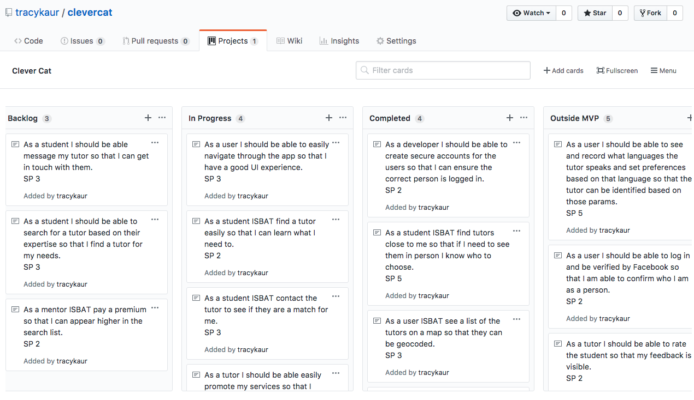
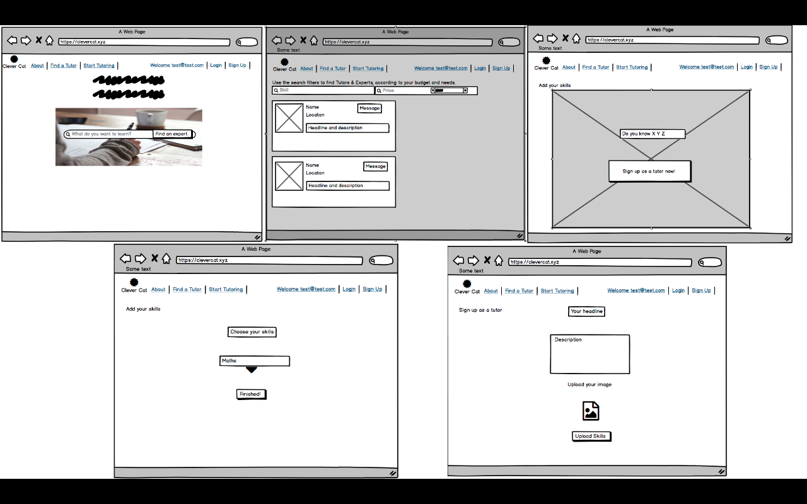
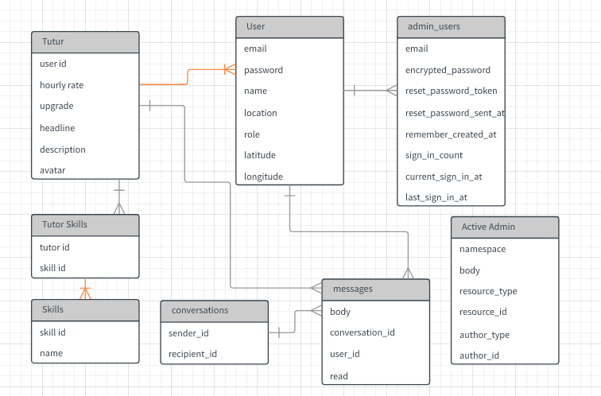
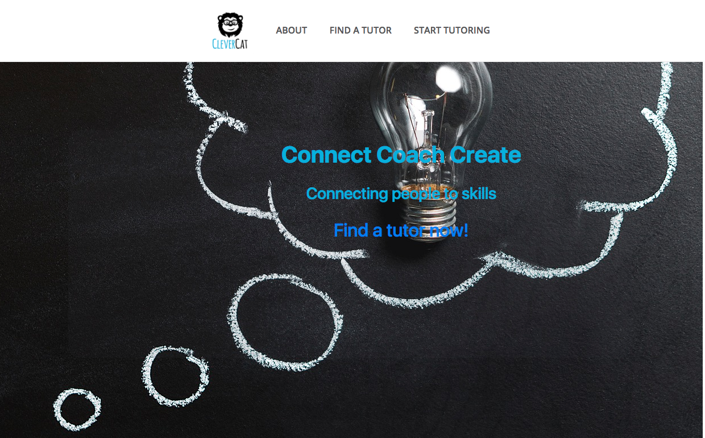
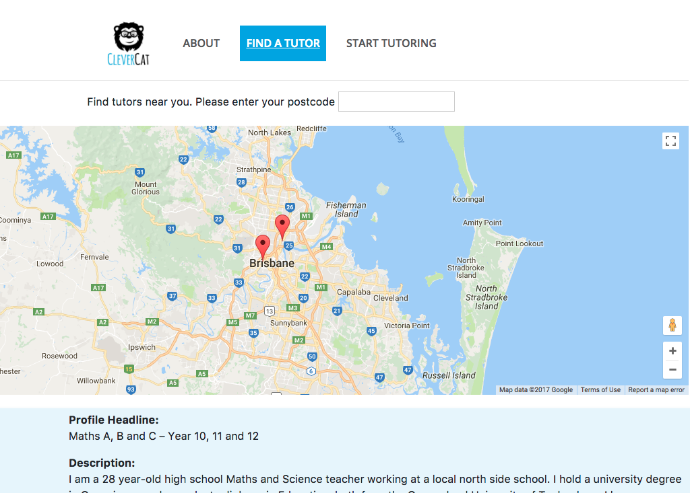
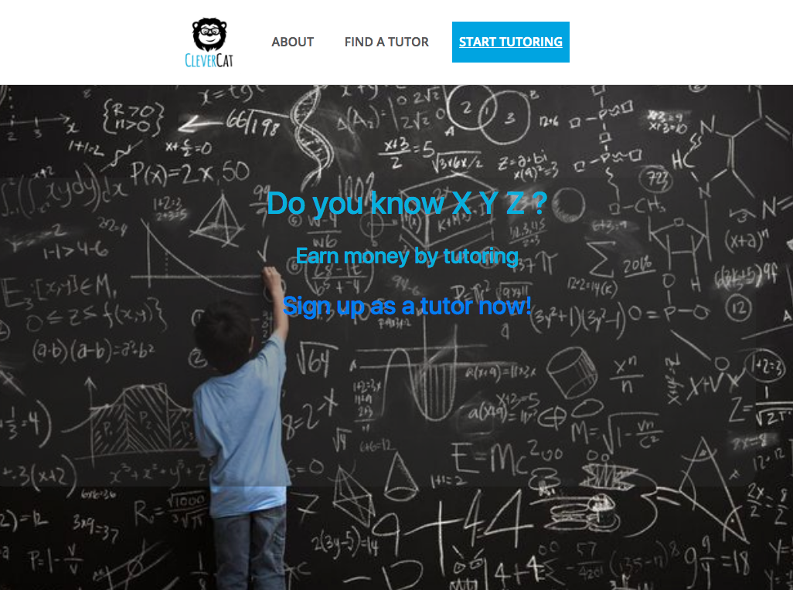

# README
# Overview

1. Summary
2. Installation
3. Requirements
4. User Stories
5. Wireframing
6. Workflow Diagram
7. Entity Relationship Diagram
8. List of Tools Used
9. Project Plan
10. Future Updates

------------------

Link : https://clevercat.xyz/
## 1. Summary
This app was designed as part of the CoderAcademy assignment to build a two-sided marketplace.

PROBLEM DEFINITION
It is difficult to find a tutor cheaply and quickly. There was a time when finding a tutor relied upon recommendations from friends or looking through newspaper adverts. Often you have to sign up through an agency and tutors can be expensive and slow to find. I decided on a tutoring app whilst trying to find a piano teacher for my son. It was impossible to find a tutor to meet on my time and schedule. Students need to find a tutor in real time and cheaply.

SOLUTION
With the immense growth and popularity of on-demand services in other major industries, it makes sense that tutoring will follow.
A tutoring app solves a real problem for students of all ages and parents — to find an affordable and knowledgeable tutor on-demand.

The design is based on a two sided marketplace whereby tutors can advertise their skills and students can search for tutors based on their skills and locations.
But now tutors are offered and reviewed online. The app allows you to seamlessly contact tutors nearby and schedule a session at a fraction of the cost of traditional services.

-----------------------
## 2 Installation
Configuration - you will not have an ENV file as this has been ignored through Git. In order to run the App you will need to create a .env file with your own mailgun and stripe API keys.
1. Clone the repo then change into the directory.
2. Run `bundle install` in terminal.
3. Run `rails db:migrate` in terminal.
4. Create a `.env` file in the root of the directory, then add your own ENV variables :
   - `STRIPE_PUBLISHABLE_KEY=XXXX`
   - `STRIPE_SECRET_KEY=XXXX`
   - `POSTGRES_PASSWORD=XXXX`
   - `MAILGUN_API_KEY=XXXX`
   - `MAILGUN_DOMAIN_KEY=XXXX`

--------------

## 3. Requirements
1. Create your application using Ruby on Rails
2. Demonstrate knowledge of Rails conventions.
3. Use postgresql database in development.
4. Use an API (eg. Omniauth, Geocoding, Maps, other..).
5. Use appropriate gems.
6. Use environmental variables to protect API keys etc.
7. Implement a payment system for your product.
8. Your app must send transactional emails (eg. using Mailgun).
9. Your app should have an internal user messaging system.
10. Your app will have some type of searching, sorting and or filtering capability.
11. Your app will have some type of file uploading capability (eg. images).
12. Your app will have authentication (eg. Devise, must have full functionality in place).
13. Your app will have authorisation (users have restrictions on what they can see and edit).
14. Your app will have an admin dashboard for the admin user to administrate the site.
15. Document your application with a README that explains how to setup, configure and use your application.

-----------------------
## 4. User Stories

-----------------------

## 5. Wireframing

-----------------------

## 6. Workflow Diagram

-------------

## 7. Entity Relationship Diagram

----------------

## 8. List of Tools Used
1. Github - Version control, user stories and to assign story points for project management.
2. Lucidchart - ERD
3. postgresql - Database
4. Devise - authentication
5. Devise-Bootstrap-Views - Devise Styling
6. aws-sdk - AWS S3 bucket
7. Namecheap - domain purchase
8. Cloudflare - DNS server
9. Webhosting - Heroku
10. Mailgun - emails
11. Stripe - payments
12. Rubocop - code quality
13. Balsamiq - wireframing
14. Paperclip - image uploads
15. dotenv-rails - environmental variables
16. geocoder - longitude latitude geocoding
17. Google Maps - map locations
18. activeadmin - admin dashboard
19. Peer code review

------------------

## 9. Project Plan

-------------------
## 10. Future Updates

